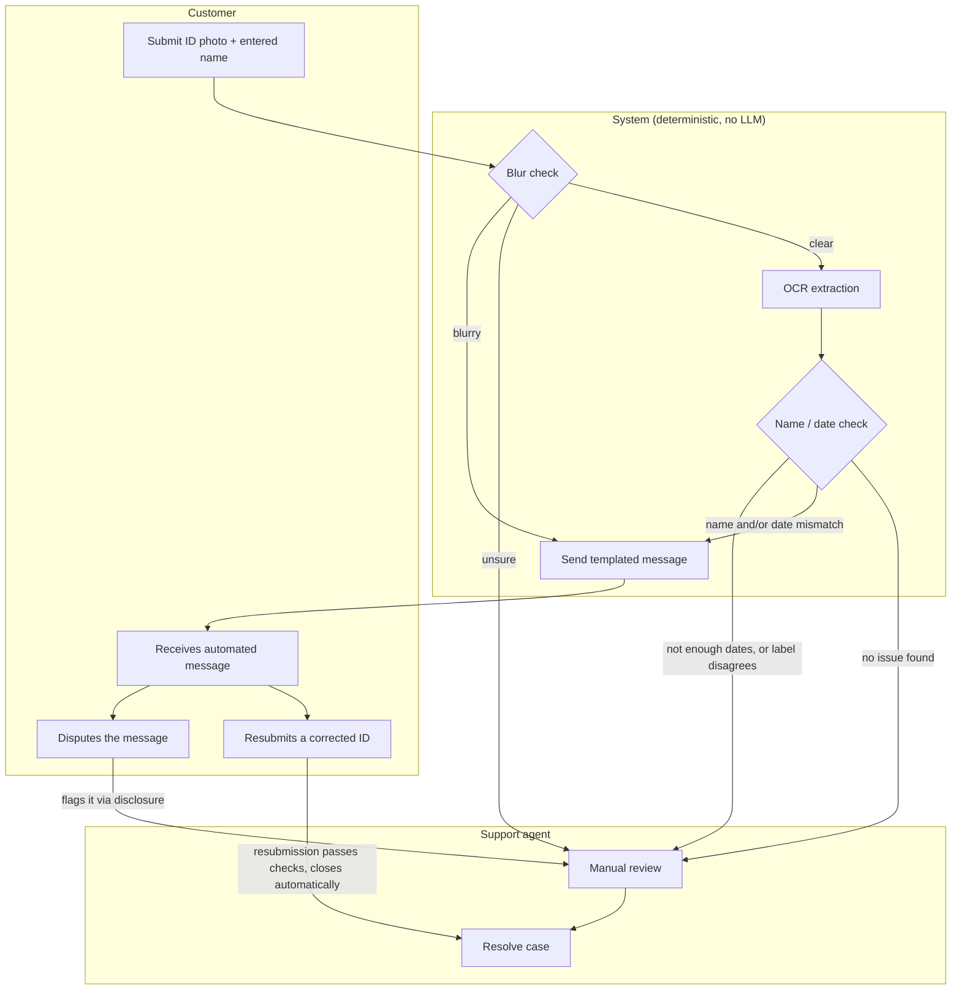

# Voltify: KYC Review Prototype

**Live demo:** https://voltify-kyc.netlify.app/

A lightweight prototype for automating triage of failed KYC (ID verification) checks,
built to prove the approach before asking engineering to build it for real.

---

## Assumptions

- Single static `index.html` file. No build step, no backend, deployed on Netlify.
- No backend to hold a real vision LLM's API key securely, so this prototype uses
  OCR.space instead: a traditional OCR API, not an LLM, whose key can be called directly
  from the browser. That key ends up exposed in client-side JS.
- The only dates assumed present on the card are date of birth, issue date, and
  expiration. Other dates some IDs have are not accounted for.
- No real database. This is a portfolio/interview prototype, not a production system.
- New cases created through the app save to `localStorage` and reload with the page.

---

## Scenarios

Three invented rejection scenarios this prototype handles end to end. Full triage note and
customer message for each: see Example Outputs.

- Scenario 1: Blurry ID
- Scenario 2: Expired ID
- Scenario 3: Name mismatch

---

## Biggest risk

**Risk:** the system is meant to reduce support workload, but a wrong auto-response can
add to it instead. If a customer gets an automated message that's incorrect or doesn't
make sense for their situation, they get frustrated, and support now has to handle both
the original case and an upset customer.

**Mitigation:** never auto-send on low-confidence data, escalate to a human instead. See
the human-in-the-loop mechanism below.

---

## How it works



Same flow, step by step:

```
INPUT: customer_id_submission (image, entered_name)

STEP 1: Image quality check (deterministic, on-device)
  # Laplacian-variance sharpness score, computed on the uploaded image via canvas
  # pixel data. No API call, no LLM.
  score = compute_sharpness(image)

  IF score < 30:                      # BLUR_THRESHOLD
      classification = "blurry"
  ELIF score > 100:                   # CLEAR_THRESHOLD
      classification = "clear"
  ELSE:
      classification = "unsure"

  IF classification == "blurry":
      SEND message = M1 + M5
      LOG triage_note = "blurry photo auto-detected, message sent"
      STOP

  IF classification == "unsure":
      flag_for_human_review(reason="low_confidence_blur_check")
      STOP

  # classification == "clear", proceed to extraction

STEP 2: OCR extraction (deterministic)
  ocr_text = run_ocr(image)   # one flat text blob, no structured fields or coordinates

STEP 3: Compare fields (deterministic)
  # Name: each word of the entered name is checked independently for presence in the
  # OCR text. Not a single contiguous "First Last" match, which breaks on reversed name
  # order, names split across OCR lines, or a middle name/initial.
  name_issue = ANY token of entered_name NOT found in ocr_text

  # Expiry: every real ID follows DOB < Issue Date < Expiry Date. So the latest
  # plausible date on the card (after dropping obviously implausible matches, more
  # than ~120 years past or ~15 years future) is treated as the expiry. This does not
  # depend on recognizing a label like "Exp" or "Expires". Label vocabulary varies too
  # much across issuers, and OCR reading order does not reliably keep a label next to
  # its value on cards with side-by-side columns.
  plausible_dates = filter_plausible(find_all_dates(ocr_text))
  IF len(plausible_dates) < 2:
      flag_for_human_review(reason="insufficient_dates_found")
      STOP
  extracted_expiry = max(plausible_dates)

  # A recognized label is only a secondary cross-check, never the primary signal.
  label_expiry = find_unambiguous_label_match(ocr_text,
      labels=["EXP","EXPIRES","EXPIRY","DATE OF EXPIRY","VALID THRU","VALID UNTIL","GOOD THRU"])
  IF label_expiry EXISTS AND label_expiry != extracted_expiry:
      flag_for_human_review(reason="date_ordering_and_label_disagree")
      STOP

  date_issue = (extracted_expiry < today)

STEP 4: Build outgoing message
  IF name_issue AND date_issue:
      SEND concatenated(M3, M4) + M5
      LOG triage_note = "name + date mismatch, message sent"
  ELIF name_issue:
      SEND M3 + M5
      LOG triage_note = "name mismatch, message sent"
  ELIF date_issue:
      SEND M4 + M5
      LOG triage_note = "date expired, message sent"
  ELSE:
      flag_for_human_review(reason="unexpected_clear_result")

STEP 5: flag_for_human_review(reason)
  DO NOT auto-send
  LOG triage_note = f"Needs human review: {reason}"
  Notify support queue

STEP 6: Customer responds to the sent message
  IF customer disputes via the disclosure link (M5):
      flag_for_human_review(reason="customer_disputed")
  ELIF customer resubmits a corrected ID:
      re-run STEPS 1-4 on the new submission
      IF no name_issue AND no date_issue:
          CLOSE case automatically
          LOG triage_note = "resubmission passed, case closed automatically"
      # otherwise the new submission's own STEP 4 outcome applies again
```

### No LLM approach: how each check works

#### Image blur

- Draw the photo onto a canvas, shrunk to 300px on the long side.
- Convert to grayscale.
- Run a Laplacian filter, measure the variance.
- Score under 30: blurry. Over 100: clear. In between: unsure.

#### Name matching

- Split the entered name into words.
- Check each word on its own, anywhere in the OCR text.
- Not case-sensitive. Order doesn't matter.
- Every word has to be found for a match.

#### Expiry date

- Find every `MM/DD/YYYY` date in the OCR text.
- Drop anything outside a plausible range (120 years back, 15 years forward).
- Sort what's left. The latest date is the expiry.
- If a label like "Exp" points at one clear date, use it as a cross-check only.
- Cross-check disagrees with the sorted guess: stop, send to a human.

## Variables

### Message table

| ID | Trigger | Message Text |
|---|---|---|
| M1 | Image blurry | "Your ID photo appears too blurry for us to verify. Please retake it in good lighting and resubmit." |
| M2 | Image quality unsure / low confidence | *(no message sent, routed to human review)* |
| M3 | Name mismatch | "We noticed the name on your ID doesn't quite match what's on file." |
| M4 | Date expired | "The ID you submitted appears to be expired. Please upload a valid, unexpired ID." |
| M5 | Automated-check disclosure (always appended) | "This check was completed automatically. If you think something's wrong, flag it here and we'll open a case for a specialist to review." |
| M6 | Unexpected clear image but KYC still failed | *(no message sent, routed to human review)* |

**Concatenation rule:** If both M3 and M4 apply, send: *"We noticed the name on your ID
doesn't quite match what's on file, and the ID also appears to be expired. Please review
both and resubmit."* Always append M5.

---

## Example Outputs

Three invented rejection scenarios. Each one shows the internal triage note (STEP 4's
`LOG`) next to the actual customer message (M5 always appended, per the rule above).

**Scenario 1: Blurry ID**

Internal triage note:

`blurry photo auto-detected, message sent`

Customer:

"Your ID photo appears too blurry for us to verify. Please retake it in good lighting and
resubmit. This check was completed automatically. If you think something's wrong, flag it
here and we'll open a case for a specialist to review."

**Scenario 2: Expired ID**

Internal triage note:

`date expired, message sent`

Customer:

"The ID you submitted appears to be expired. Please upload a valid, unexpired ID. This
check was completed automatically. If you think something's wrong, flag it here and we'll
open a case for a specialist to review."

**Scenario 3: Name mismatch**

Internal triage note:

`name mismatch, message sent`

Customer:

"We noticed the name on your ID doesn't quite match what's on file. This check was
completed automatically. If you think something's wrong, flag it here and we'll open a
case for a specialist to review."

---

## Possible cases

The triage logic can produce these outcomes:

| Status | Scenario |
|---|---|
| Resolved by Agent | Name mismatch, automated message sent, customer disputes it, a human agent manually closes the case |
| Needs Review | Image quality inconclusive ("unsure"), routed to a human, no message sent |
| Pending Customer | Expired ID, automated message sent, case stays open until resubmission |
| Needs Review | Classification failed validation twice in a row, retry limit hit, escalated to a human |
| Pending Customer | Both name and expiry wrong at once, one concatenated automated message sent |
| Needs Review | Only one date found on the card, not enough to sort chronologically, escalated |
| Closed | Customer resubmits a corrected ID, it passes the automated checks, case closes automatically, no human involved |

**Status model:**

- **Needs Review** (red): system couldn't confidently triage, or a customer disputed.
- **Resolved by Agent** (indigo): a human manually closed it, shows agent name.
- **Pending Customer** (amber): system sent an automated message, no agent involved, case
  is not resolved, waiting on the customer to act.
- **Closed** (green): a resubmission passed every check, no dispute, no agent involved.

---

## Deterministic logic and the human-in-the-loop mechanism

No LLM is called anywhere in this implementation. Image quality, name matching, and date
matching are all rule-based:

- **Image quality:** an on-device Laplacian-variance sharpness score.
- **Name matching:** a token-based presence check, not a single exact-phrase comparison.
- **Expiry date check:** chronological ordering of every date on the card, cross-checked
  against a recognized label only when one exists and unambiguously names a single date.
- **Customer messages:** static, pre-written templates. No free text generation, so no
  hallucination risk in the messages themselves.

**Where the human checkpoint sits:**

- A borderline sharpness score ("unsure") goes to a human. Nothing gets sent
  automatically.
- Extraction refuses to guess: fewer than two plausible dates, or a genuine disagreement
  between the ordering guess and a recognized label, both escalate to a human.
- Every auto-sent message discloses that the check was automated (M5) and invites the
  customer to flag it for human review. Peter Parker's mocked row shows this end to end:
  customer disputes, a human reviews it, agent resolves the case.
- A dispute is the only path to a human that's actually wired up in this prototype. The
  resubmission-passes-so-close-automatically path (STEP 6) is the intended design, not
  yet implemented: there's no code here that re-checks an existing case against a new
  upload. The mocked "Pending Customer" rows just say the ticket is held pending
  resubmission, without showing what happens next.

**If a real vision LLM were used instead** of the on-device sharpness check: every
response would be checked against a fixed list of 3 allowed answers. A response that
doesn't match one of them gets retried once. If it still fails, don't guess, go straight
to a human. That's the mechanism for catching a wrong or hallucinated model answer.

---

## Challenges

Grouped by what part of the ID they affect: image, date, or name. Likelihood notes are
reasoned estimates, not measured rates — testing against real data would replace them with
actual numbers.

- **Image**
  - **Sharpness vs. legibility**
    - A blurry photo can still score "clear."
    - A sharp photo can score low if it gets shrunk before checking.
    - Doesn't catch a scratch over a letter, tiny text, or bad cropping either.
    - Still open.
    - Likelihood: low with a normal phone photo in good light. Higher with scans, low light, or heavy compression.
  - **OCR inventing data from noise**
    - A smudge on a bad photo can get read as a real letter or number.
    - That fake text can still look like a real date or name.
    - Just checking "something is there" isn't enough. Needs real validation. Not built yet.
    - Likelihood: rises with blur or glare. A single misread digit is much more likely than OCR inventing a whole fake date or name from nothing.
  - **Reading the whole image instead of set fields**
    - OCR reads the whole photo, then the system sorts out the text after.
    - Fix idea: map out where the name, DOB, ID number, and expiry sit on each ID layout. Only read inside those spots.
    - Likelihood: not a per-case risk. It's true on every case, and it's what makes the two risks above possible.

- **Date**
  - **Only one date format supported**
    - Only reads `MM/DD/YYYY`, with slashes.
    - Misses `DD/MM/YYYY`, dots, dashes, or dates like `15 JAN 2028`.
    - Likelihood: depends entirely on which IDs get submitted. Zero risk for US-format IDs, high risk for anything else.
  - **No check on age or ID validity length**
    - Doesn't check if the birth date makes sense for an ID. A 5-year-old's birth date would still pass.
    - Doesn't check if the issue-to-expiry gap matches a normal length (often around 7 years).
    - Fix idea: add both as extra checks.
    - Likelihood: low on its own, most real IDs won't trip this. But it's an unguarded gap, not a tested-and-rare case.

- **Name**
  - **Name order isn't verified, just ignored**
    - Example: card shows `SAMPLE` / `JANICE` instead of `Janice Sample`.
    - Checking each word independently avoids wrongly flagging this as a mismatch, when it's really the same person's ID.
    - But that's not a real fix. The system never verifies order at all, so it can't tell a legitimate swap from a coincidence or from someone else's card.
    - OCR.space can't help here either. It just reads text. It doesn't know which word is a first name or a last name.
    - Real fix needs geometric slicing: read each field by its position on a template, not by scanning the whole blob.
    - Likelihood: the false-mismatch symptom this masks is common, many ID layouts print last name first. The risk it creates instead (below) isn't measured.
  - **Name matching doesn't know which field it's in**
    - Matches a word anywhere on the card, not just the name field.
    - Example: `"Jordan Blake"` would match `"123 Jordan Street"`.
    - Fix idea: same field-mapping idea as above. Needs more work.
    - Likelihood: low for most names, higher for names that are also common street or place words (Jordan, Madison, Lincoln).
  - **Two people with swapped names could match each other**
    - Example: `"James Robert"` and `"Robert James"` are different people.
    - The system only checks if each word is present, not which field it's in.
    - Entering one name could wrongly match the other person's ID.
    - Fix idea: match by field label (First Name vs. Last Name), not by position. Geometric slicing would fix this without breaking the same-person reversed-order case above.
    - Likelihood: rare. Needs two different real people whose names are exact reverses of each other, both showing up as cases.

Before increasing automation on any of these: test against real data, measure actual error
rates, and keep sending low-confidence cases to a human rather than guessing.
