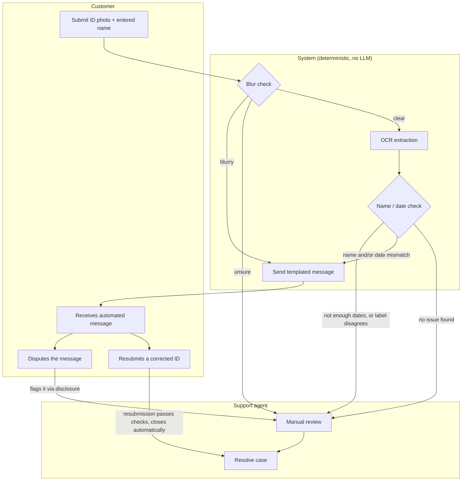

# Voltify: KYC Review Prototype

**Live demo:** https://voltify-kyc.netlify.app/

A lightweight prototype for automating triage of failed KYC (ID verification) checks,
built to prove the approach before asking engineering to build it for real.

---

## Assumptions

- Single static `index.html` file. No build step, no backend, deployed on Netlify.
- The 10 mocked queue rows are the deterministic path's real output (OCR.space, a
  traditional OCR API, not an LLM), verified against the actual code. The LLM readings
  documented below them were produced by reading the same card images directly in
  conversation (Claude), not through a live API call, so they're a comparison, not a
  second live path in the mocked data.
- Create Case does have a live LLM path: pick "LLM (live API)" and paste an OpenAI API key
  to run a real request (GPT-4o) against the same prompt documented below. That's a
  different model than the one used for the documented comparison, so a live run isn't
  guaranteed to match those readings exactly, the underlying questions being asked are the
  same either way. The key is only held in memory for that one request, never written to
  `localStorage`, but it's still typed into client-side JS and sent straight from the
  browser, fine for trying this out yourself, not a pattern to ship. A production version
  would hold the key behind a server-side proxy instead, the same gap that already exists
  for the OCR.space key used by the deterministic path.
- The only dates assumed present on the card are date of birth, issue date, and
  expiration. Other dates some IDs have are not accounted for.
- No real database. This is a portfolio/interview prototype, not a production system.
- New cases created through the app save to `localStorage` and reload with the page.

---

## Scenarios

Three invented rejection scenarios this prototype handles end to end. Full triage note and
customer message for each: see Example Outputs.

- Scenario 1: Blurry ID
- Scenario 2: Expired ID
- Scenario 3: Name mismatch

---

## Biggest risk

**Risk:** the system is meant to reduce support workload, but a wrong auto-response can
add to it instead. If a customer gets an automated message that's incorrect or doesn't
make sense for their situation, they get frustrated, and support now has to handle both
the original case and an upset customer.

**Mitigation:** never auto-send on low-confidence data, escalate to a human instead.

---

## After the reason is found

Once a check finishes, this is what happens with the outcome, the case status it becomes
and the message that goes out. Same rules either way, whether the check that produced the
reason was deterministic or an LLM read, both approaches below build the exact same case
shape (status, validation rows, timeline, follow-up action) from whatever they find. What
differs between the two approaches is only how the underlying reason gets found, that's
covered separately in each expandable section below.

### Case status

| Status | Meaning | Example scenarios |
|---|---|---|
| **Needs Review** (red) | System couldn't confidently triage, or a customer disputed. | Image quality inconclusive ("unsure"), no message sent · Classification failed validation twice, retry limit hit · Only one date found on the card, not enough to sort chronologically |
| **Resolved by Agent** (indigo) | A human manually closed it, shows agent name. | Name mismatch, automated message sent, customer disputes it, an agent manually closes the case |
| **Pending Customer** (amber) | System sent an automated message, no agent involved, case is not resolved, waiting on the customer to act. | Expired ID, case stays open until resubmission · Both name and expiry wrong at once, one concatenated message sent |
| **Closed** (green) | A resubmission passed every check, no dispute, no agent involved. | Customer resubmits a corrected ID, it passes the automated checks, case closes automatically |

### Customer message

| ID | Trigger | Message Text |
|---|---|---|
| M1 | Image blurry | "Your ID photo appears too blurry for us to verify. Please retake it in good lighting and resubmit." |
| M2 | Image quality unsure / low confidence | *(no message sent, routed to human review)* |
| M3 | Name mismatch | "We noticed the name on your ID doesn't quite match what's on file." |
| M4 | Date expired | "The ID you submitted appears to be expired. Please upload a valid, unexpired ID." |
| M5 | Automated-check disclosure (always appended) | "This check was completed automatically. If you think something's wrong, flag it here and we'll open a case for a specialist to review." |
| M6 | Unexpected clear image but KYC still failed | *(no message sent, routed to human review)* |

**Concatenation rule:** If both M3 and M4 apply, send: *"We noticed the name on your ID
doesn't quite match what's on file, and the ID also appears to be expired. Please review
both and resubmit."* Always append M5.

---

<details>
<summary><strong>Deterministic approach</strong> (click to expand)</summary>

## How it works



Same flow, step by step:

```
INPUT: customer_id_submission (image, entered_name)

STEP 1: Image quality check (deterministic, on-device)
  # Laplacian-variance sharpness score, computed on the uploaded image via canvas
  # pixel data. No API call, no LLM.
  score = compute_sharpness(image)

  IF score < 30:                      # BLUR_THRESHOLD
      classification = "blurry"
  ELIF score > 100:                   # CLEAR_THRESHOLD
      classification = "clear"
  ELSE:
      classification = "unsure"

  IF classification == "blurry":
      SEND message = M1 + M5
      LOG triage_note = "blurry photo auto-detected, message sent"
      STOP

  IF classification == "unsure":
      flag_for_human_review(reason="low_confidence_blur_check")
      STOP

  # classification == "clear", proceed to extraction

STEP 2: OCR extraction (deterministic)
  ocr_text = run_ocr(image)   # one flat text blob, no structured fields or coordinates

STEP 3: Compare fields (deterministic)
  # Name: each word of the entered name is checked independently for presence in the
  # OCR text. Not a single contiguous "First Last" match, which breaks on reversed name
  # order, names split across OCR lines, or a middle name/initial.
  name_issue = ANY token of entered_name NOT found in ocr_text

  # Expiry: every real ID follows DOB < Issue Date < Expiry Date. So the latest
  # plausible date on the card (after dropping obviously implausible matches, more
  # than ~120 years past or ~15 years future) is treated as the expiry. This does not
  # depend on recognizing a label like "Exp" or "Expires". Label vocabulary varies too
  # much across issuers, and OCR reading order does not reliably keep a label next to
  # its value on cards with side-by-side columns.
  plausible_dates = filter_plausible(find_all_dates(ocr_text))
  IF len(plausible_dates) < 2:
      flag_for_human_review(reason="insufficient_dates_found")
      STOP
  extracted_expiry = max(plausible_dates)

  # A recognized label is only a secondary cross-check, never the primary signal.
  label_expiry = find_unambiguous_label_match(ocr_text,
      labels=["EXP","EXPIRES","EXPIRY","DATE OF EXPIRY","VALID THRU","VALID UNTIL","GOOD THRU"])
  IF label_expiry EXISTS AND label_expiry != extracted_expiry:
      flag_for_human_review(reason="date_ordering_and_label_disagree")
      STOP

  date_issue = (extracted_expiry < today)

STEP 4: Build outgoing message
  IF name_issue AND date_issue:
      SEND concatenated(M3, M4) + M5
      LOG triage_note = "name + date mismatch, message sent"
  ELIF name_issue:
      SEND M3 + M5
      LOG triage_note = "name mismatch, message sent"
  ELIF date_issue:
      SEND M4 + M5
      LOG triage_note = "date expired, message sent"
  ELSE:
      flag_for_human_review(reason="unexpected_clear_result")

STEP 5: flag_for_human_review(reason)
  DO NOT auto-send
  LOG triage_note = f"Needs human review: {reason}"
  Notify support queue

STEP 6: Customer responds to the sent message
  IF customer disputes via the disclosure link (M5):
      flag_for_human_review(reason="customer_disputed")
  ELIF customer resubmits a corrected ID:
      re-run STEPS 1-4 on the new submission
      IF no name_issue AND no date_issue:
          CLOSE case automatically
          LOG triage_note = "resubmission passed, case closed automatically"
      # otherwise the new submission's own STEP 4 outcome applies again
```

### No LLM approach: how each check works

#### Image blur

- Draw the photo onto a canvas, shrunk to 300px on the long side.
- Convert to grayscale.
- Run a Laplacian filter, measure the variance.
- Score under 30: blurry. Over 100: clear. In between: unsure.

#### Name matching

- Split the entered name into words.
- Check each word on its own, anywhere in the OCR text.
- Not case-sensitive. Order doesn't matter.
- Every word has to be found for a match.

#### Expiry date

- Find every date in the OCR text, slash, dash, or dot separated.
- Whichever number is over 12 must be the day, that's how day/month order gets figured
  out automatically. If both numbers could be either, default to month first.
- Drop anything outside a plausible range (120 years back, 15 years forward).
- Sort what's left. The latest date is the expiry.
- If a label like "Exp" points at one clear date, use it as a cross-check only.
- Cross-check disagrees with the sorted guess: stop, send to a human.

## Example Outputs

Every mocked case in the queue is a verified result of running the actual deterministic
logic above against its image, not hand-typed data. See them live:
**https://voltify-kyc.netlify.app/**

## Challenges

What can go wrong with each part of the deterministic pipeline, and the recommended
mitigation for each. None of this is fundamental: every gap below has an identifiable fix,
this is a punch list, not a ceiling.

- **Image**
  - **Sharpness ≠ legibility.** A sharpness score can miss scratches, glare, bad cropping,
    or text that's technically sharp but unreadable.
    **Recommended mitigation:** add real image quality and legibility checks.
  - **OCR can misread text.** A bad image can produce a plausible but incorrect name or
    date.
    **Recommended mitigation:** validate extracted fields before using them.
  - **Whole-image OCR.** The current approach reads one text blob, so it doesn't know
    which text belongs to which field.
    **Recommended mitigation:** read known fields by their position on the ID.

- **Date**
  - **Ambiguous dates.** `03/04/2025` can still be interpreted incorrectly when both
    numbers could be a day or month.
    **Recommended mitigation:** use the document layout, or flag genuinely ambiguous dates
    for review.
  - **Unusual date formats.** Spelled-out dates or non-standard expiry values (like
    `NEVER`) can be missed.
    **Recommended mitigation:** support more formats and define how values like `NEVER`
    are handled.
  - **Limited validation.** The current logic doesn't check whether the dates make sense
    for the person's age, or whether the validity period is plausible.
    **Recommended mitigation:** add these as secondary checks.

- **Name**
  - **Name matching isn't field-aware.** The current approach looks for each name word
    anywhere in the OCR text. This can create false matches.
    **Recommended mitigation:** match names within the actual name fields.
  - **Name order is ignored.** This avoids false mismatches when IDs print last name
    first, but can also allow incorrect matches.
    **Recommended mitigation:** identify first and last name fields instead of only
    checking whether the words exist.

</details>

---

<details>
<summary><strong>LLM solution</strong> (click to expand)</summary>

## LLM solution

For comparison, the card images used in the queue were read directly by a vision-capable
LLM, the same way the deterministic pipeline gets demonstrated on all 10 mocked rows.
Here's what it produced for each.

### Prompt

No live API call was made for these readings, they were produced by reading each image
directly within this conversation, not through a separate prompted API request. So this
isn't a transcript of an actual call. It's the prompt a real implementation would send,
written to ask for the same fields the deterministic pipeline checks (image quality, name,
expiry), in a fixed format so a malformed response is easy to detect (see Human in the
loop above):

```
Here's a photo of a customer's ID [image attached].

Read the card and tell me:
- Image Quality : "clear" , "unsure" , "blurry"
- First and Last name as printed, or NULL
- Is it expired? or NULL

Only report what's actually visible on the card, don't guess or fill in anything that
isn't printed. If you are unsure if the image quality is clear or blurry always return
"unsure"
```

**Blurry ID (John Smith)**

- Deterministic: refuses to read it. Sharpness score 12 auto-classifies as blurry before
  OCR ever runs.
- LLM: can still make out most of the card despite the blur, "JOHN SMITH," a birth date,
  an expiry, an ID number, using context (expected card layout) to fill in what individual
  pixels don't fully resolve.
- Risk: an LLM reading through blur isn't automatically a good thing. Getting a digit
  wrong while sounding confident is a worse failure than correctly saying "too blurry."

**Name mismatch (Peter Parker)**

- Deterministic: reads "LAST NAME: Man, FIRST NAME: Spider." No slash-formatted date
  anywhere on the card, so it stops at "insufficient dates found" and never even reaches a
  name decision.
- LLM: reads the same fields, easily recognizes this is a joke Spider-Man license, and
  would compare "Spider Man" against "Peter Parker" as a mismatch. `ID: 08 10 19 62` is
  clearly labeled as the ID number, not a date, so a careful read wouldn't try to parse it
  as one. There's no real date anywhere on this card either way.

**A hallucination that happened during this run, and why it matters**

On the first read of this card, the LLM read `ID: 08 10 19 62` as a plausible date instead
of what it actually is: a number clearly labeled `ID:` right on the card. That's the exact
failure mode this whole document warns about, pattern-matching something that looks
numeric into the shape you're expecting to find, instead of reading what's actually
labeled. It got caught and corrected here. In a real pipeline with no one checking, that
reading would have gone straight into a decision. This isn't a hypothetical risk being
described, it's the same mistake happening in the process of writing this comparison.

**Name + date mismatch (Jordan Blake)**

- Deterministic: "J. BLAKE" doesn't contain the token "Jordan," so it's flagged as a hard
  mismatch. Expiry 01/05/2024 is correctly read as expired.
- LLM: also reads the card correctly, but can reasonably judge "J. Blake" as very likely
  an abbreviation of "Jordan Blake," a judgment call the token check has no way to make.
  Same conclusion on the expired date.
- Why that's not necessarily good: KYC name checks are usually assumed to need an exact
  match, not a plausible one. The LLM accepting "J." as "Jordan" is a guess dressed up as
  a read. It might be right most of the time, but "probably the same person" isn't the bar
  identity verification is supposed to clear, and this is exactly the kind of judgment
  call that should go to a human instead of getting auto-approved (see Where
  human-in-the-loop should be, below).

**Insufficient dates, dash format (Barbie)**

- Deterministic: birth date prints as `03-10-1959` (dashes, not slashes) and expiry reads
  `NEVER`. Neither matches the parser's date regex, so it finds 0 dates and stops at
  "insufficient dates found."
- LLM: can parse `03-10-1959` as a date regardless of the dashes, no format rigidity. It
  can also read `EXPIRES: NEVER` as a real (if unusual) value rather than just failing to
  match a pattern.

**Insufficient dates, only one printed (Devon Blackwood)**

- Deterministic: only one date on the card at all (date of birth). Needs two to sort
  chronologically, so it stops at "insufficient dates found," same reason as Barbie's row
  but for a different cause.
- LLM: reads the same single date, but can also read `CLASS: PERMANENT` and reasonably
  infer that's *why* there's no expiry field, some ID types genuinely don't expire, rather
  than assuming data is simply missing. Again, a contextual read the deterministic system
  isn't built to make.

**Unexpected clear result (Riley Morgan)**

- Deterministic: name checks out (`Riley`, `Morgan` both found), expiry `11/14/2027` is
  unexpired. Both checks pass, but the case still needs a human look, since it arrived
  here as an already-failed KYC check with no automated reason pointing to why.
- LLM: reads the same fields the same way, `RILEY MORGAN`, `04/22/1994`, `11/14/2027`,
  and reaches the same conclusion: nothing here explains the original failure. Where an
  LLM pipeline could fail differently on a case like this isn't the reading, it's
  elsewhere: the API call itself timing out or erroring, a different failure mode than a
  text-extraction service returning bad data.

### Challenges

The same challenges documented for the deterministic approach above, checked one by one
against an LLM approach: still a problem, solved, or a new shape of the same problem.

- **Image**
  - **Sharpness ≠ legibility.** The prompt only asks for the same three-way call the
    deterministic check makes (clear, unsure, blurry), so that's the only image challenge
    being compared here, not image quality problems in general. Still a problem, different
    shape: no numeric score to set a threshold on, so "how blurry is too blurry" becomes a
    judgment call instead of a number. The instruction to default to "unsure" when in doubt
    is the only guardrail on that judgment. Actually improved in one way: an LLM can likely
    tell a scratch over a letter apart from ordinary blur, something a sharpness score
    treats the same, though the prompt doesn't ask about scratches or cropping
    specifically, so that's a possible improvement, not a tested one. The risk of reading
    through blur instead of correctly refusing it is covered under the John Smith case
    above, not repeated here.
  - **OCR can misread text** and **whole-image OCR** aren't image-quality questions, they're
    about extracting the name and date correctly. Covered under Name and Date below instead
    of here.

- **Date**
  - **Ambiguous dates.** Not fixed by being a better reader. For `03/04/2025` (both numbers
    ≤12), there's no information on the card resolving which is which. Without a
    country/format hint, either printed on the card or given in the prompt, an LLM has the
    same missing information the deterministic parser does, and is guessing too.
  - **Unusual date formats.** Solved. An LLM reads spelled-out months, unusual separators,
    and unusual values like `EXPIRES: NEVER` without needing a new rule written for each
    one.
  - **Limited validation.** Not automatic. An LLM won't spontaneously flag an implausible
    age or validity gap unless it's explicitly asked to. Same gap, just moved from "missing
    code" to "missing prompt instruction."

- **Name**
  - **Name matching isn't field-aware.** Mostly solved. An LLM naturally reads label-value
    pairs ("FULL NAME: ...") using the card's layout, so it isn't just checking presence
    anywhere in a flat text blob, it can check the right field. That also means it doesn't
    need a separate zone map the way flat OCR text does.
  - **Name order is ignored.** Mostly solved the same way: an LLM can read which field is
    actually labeled "First Name" vs. "Last Name." Reduced, not gone: it still can't tell
    two different people apart if they genuinely share the exact same full name. No reading
    approach, deterministic or LLM, can solve that on its own.

</details>

---

## Human in the loop

Where each approach stops and sends a case to a human instead of deciding on its own:

| Trigger | Deterministic | LLM |
|---|---|---|
| Image quality too poor for a reliable read | Should not try to make a decision from unreliable text, e.g. John Smith. Sharpness score lands below the clear threshold or in the "unsure" range, nothing sent automatically. | Reports "unsure", or the image is too unclear to read reliably (John Smith). Reading through blur can produce a convincing but wrong value. |
| A value can't be parsed into a known format | Needs a defined rule before it can act, e.g. an unusual date format or `EXPIRES: NEVER`. Same reason fewer than two plausible dates on a card stops the check entirely. | `EXPIRES: NEVER` or `CLASS: PERMANENT`. The LLM can identify these values, but the system still needs a defined business rule before acting on them. |
| The name match is ambiguous | Should not make assumptions about whether two names are the same person, e.g. `J. BLAKE` vs. `Jordan Blake`. Only exact token presence counts, there's no interpretation step to get wrong. | `J. BLAKE` read as a likely match for `Jordan Blake`. The LLM can suggest it, but it shouldn't be auto-approved. |
| Different checks produce conflicting results | E.g. the extracted dates and a recognized label don't agree, stops rather than picking one. | No equivalent cross-check exists in a single read, nothing here re-reads the same field a second way to catch a disagreement. |
| Customer disputes the automated message | The only human path actually wired up in this prototype (Jordan Blake's mocked row shows it end to end: dispute, human review, agent resolves). | Same disclosure and dispute mechanism, this part of the workflow doesn't change based on which engine produced the message. |

The deterministic approach is intentionally conservative: when the rules can't reach a
clear answer, it escalates rather than guessing. The LLM can read more context than a
fixed set of rules, but that doesn't automatically make its interpretation safe to act on
either.

---

## Output comparison

Every case in the queue, deterministic result vs. LLM reading, side by side.

| Case | Deterministic output | LLM output | Agree? |
|---|---|---|---|
| Peter Parker | Insufficient dates found → Needs Review, no message sent | Same on the corrected read: no real date on the card, name reads "Spider Man" vs. entered "Peter Parker". But the first read hallucinated `ID: 08 10 19 62` as a date, see the callout above | Yes on the corrected read, not on the first one |
| John Smith | Sharpness score 12, below threshold → blurry, auto-sent M1 | Can still make out most fields despite the blur | No. LLM reads through what the deterministic check correctly refuses |
| Barbie | 1 date only (dash format) → insufficient dates found → Needs Review | Can parse the dash-format birth date and the "NEVER" expiry as real values | No. LLM would extract more, but "NEVER" still isn't a computable expiry either way |
| Riley Morgan | Name and date both check out → unexpected clear result, Needs Review | Same reading, same conclusion | Yes |
| Jordan Blake | "Jordan" not found in "J. BLAKE" → hard mismatch; expiry 01/05/2024 expired | Same date reading; would judge "J." as a likely match for "Jordan," a guess the deterministic check doesn't make | Partial. Same date, different name verdict |
| Devon Blackwood | Only 1 date (DOB) → insufficient dates found → Needs Review | Same reading, could reasonably infer "CLASS: PERMANENT" explains the missing expiry | Yes on the outcome, LLM adds context |
| Alex Anderson | Name matches, DD/MM date now parsed correctly (not expired) → unexpected clear result | Same reading, same conclusion | Yes |
| Brenna Murphy | Name matches (reversed, comma-separated), expiry 08/20/2020 expired → auto-sent message | Same reading, same conclusion | Yes |
| Janice Sample | Name matches, expiry 08/05/2023 expired → auto-sent message | Same reading, same conclusion | Yes |
| Michael Motorist | Name matches (reversed, comma-separated), expiry 08/31/2021 expired → auto-sent message | Same reading, same conclusion | Yes |

---

## Compare results

| | Deterministic (this prototype) | LLM |
|---|---|---|
| Model | None. Laplacian-variance math + regex + string matching. | Claude (vision-capable multimodal model) |
| Why it decided something | Fully traceable. Every decision maps to one line of pseudocode. | Not traceable. No way to know why it accepted an abbreviation without asking it, and it could be wrong. |
| Hallucination risk in determining the failure reason | The actual task on both sides, never writing the message (that's always a fixed template once a reason is picked). A misread digit or field can produce the wrong reason. | Same task, higher risk: a wrong-but-confident field read produces the wrong reason, with nothing built in to catch it. |
| Cost per case | Free-tier OCR call, near-zero. | A paid API call per image, real ongoing cost at volume. |
| Speed | Fast, single OCR round trip. | Slower, and depends on the provider's response time. |
| Consistency | Same image always produces the same result. | Can vary between runs on the same image. |

---

## Conclusion

The goal is simple: figure out why a KYC check failed, and take the right action.

We tested the deterministic approach against an LLM on 10 cases:

- 7 cases: both reached the same conclusion.
- 3 cases: they differed.

The 3 differences were:

- **John Smith:** the LLM could read a blurry ID that the deterministic check rejected.
- **Barbie:** the LLM understood an unusual date/expiry value that the deterministic
  parser didn't.
- **Jordan Blake:** the LLM treated `J. Blake` as a possible match for `Jordan Blake`,
  while the deterministic check correctly treated it as different.

These differences don't yet mean the LLM is the better solution. The first two are gaps in
the current deterministic implementation, and we already have fixes identified for them.
The third is a judgment call that may actually be safer to send to a human than to let an
LLM decide automatically.

So the next step shouldn't be to replace the deterministic approach with an LLM. First,
finish and test the deterministic approach. Then run the LLM alongside it. At that point,
if they disagree:

- the deterministic system may have missed something the LLM can genuinely handle better, or
- the LLM may be making a confident mistake.

Either way, the disagreement is a useful signal to send the case to a human.

One important caveat: these 10 cases are hand-picked examples, not enough to measure
accuracy or prove which approach is better. The real test is a larger, labeled set of
failed KYC cases where we can measure how often each approach gets the failure reason
right, and whether disagreements are a good predictor of cases that need human review.

---

## Recommendations

Per-challenge fixes are documented inline as "Recommended mitigation" under each
Challenges section above. These are the recommendations that apply across the project as
a whole, not to one specific gap:

- Before increasing automation, test against real KYC data and measure the actual error
  rate for both approaches. The 10 cases documented here are hand-picked examples, not a
  measured sample.
- Finish the deterministic approach's known gaps first (see Challenges within the
  Deterministic approach above), rather than reaching for an LLM to cover for them.
- Once the deterministic approach is solid, run the LLM alongside it rather than replacing
  it. A disagreement between the two is a useful signal to send a case to a human, whichever
  approach turns out to be right.
- Never auto-send a message based on a low-confidence read or a judgment call, like an
  abbreviation match or an unusual value interpretation. Route those to a human every time.

