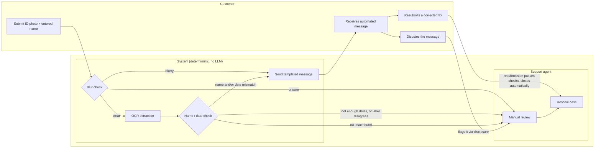

# Voltify: KYC Review Prototype

**Live demo:** https://voltify-kyc.netlify.app/

A lightweight prototype for automating triage of failed KYC (ID verification) checks,
built to prove the approach before asking engineering to build it for real.

---

## How it works



Same flow, step by step:

```
INPUT: customer_id_submission (image, entered_name)

STEP 1: Image quality check (deterministic, on-device)
  # Laplacian-variance sharpness score, computed on the uploaded image via canvas
  # pixel data. No API call, no LLM.
  score = compute_sharpness(image)

  IF score < 30:                      # BLUR_THRESHOLD
      classification = "blurry"
  ELIF score > 100:                   # CLEAR_THRESHOLD
      classification = "clear"
  ELSE:
      classification = "unsure"

  IF classification == "blurry":
      SEND message = M1 + M5
      LOG triage_note = "blurry photo auto-detected, message sent"
      STOP

  IF classification == "unsure":
      flag_for_human_review(reason="low_confidence_blur_check")
      STOP

  # classification == "clear", proceed to extraction

STEP 2: OCR extraction (deterministic)
  ocr_text = run_ocr(image)   # one flat text blob, no structured fields or coordinates

STEP 3: Compare fields (deterministic)
  # Name: each word of the entered name is checked independently for presence in the
  # OCR text. Not a single contiguous "First Last" match, which breaks on reversed name
  # order, names split across OCR lines, or a middle name/initial.
  name_issue = ANY token of entered_name NOT found in ocr_text

  # Expiry: every real ID follows DOB < Issue Date < Expiry Date. So the latest
  # plausible date on the card (after dropping obviously implausible matches, more
  # than ~120 years past or ~15 years future) is treated as the expiry. This does not
  # depend on recognizing a label like "Exp" or "Expires". Label vocabulary varies too
  # much across issuers, and OCR reading order does not reliably keep a label next to
  # its value on cards with side-by-side columns.
  plausible_dates = filter_plausible(find_all_dates(ocr_text))
  IF len(plausible_dates) < 2:
      flag_for_human_review(reason="insufficient_dates_found")
      STOP
  extracted_expiry = max(plausible_dates)

  # A recognized label is only a secondary cross-check, never the primary signal.
  label_expiry = find_unambiguous_label_match(ocr_text,
      labels=["EXP","EXPIRES","EXPIRY","DATE OF EXPIRY","VALID THRU","VALID UNTIL","GOOD THRU"])
  IF label_expiry EXISTS AND label_expiry != extracted_expiry:
      flag_for_human_review(reason="date_ordering_and_label_disagree")
      STOP

  date_issue = (extracted_expiry < today)

STEP 4: Build outgoing message
  IF name_issue AND date_issue:
      SEND concatenated(M3, M4) + M5
      LOG triage_note = "name + date mismatch, message sent"
  ELIF name_issue:
      SEND M3 + M5
      LOG triage_note = "name mismatch, message sent"
  ELIF date_issue:
      SEND M4 + M5
      LOG triage_note = "date expired, message sent"
  ELSE:
      flag_for_human_review(reason="unexpected_clear_result")

STEP 5: flag_for_human_review(reason)
  DO NOT auto-send
  LOG triage_note = f"Needs human review: {reason}"
  Notify support queue

STEP 6: Customer responds to the sent message
  IF customer disputes via the disclosure link (M5):
      flag_for_human_review(reason="customer_disputed")
  ELIF customer resubmits a corrected ID:
      re-run STEPS 1-4 on the new submission
      IF no name_issue AND no date_issue:
          CLOSE case automatically
          LOG triage_note = "resubmission passed, case closed automatically"
      # otherwise the new submission's own STEP 4 outcome applies again
```

## Deterministic logic and the human-in-the-loop mechanism

No LLM is called anywhere in this implementation. Image quality, name matching, and date
matching are all rule-based:

- **Image quality:** an on-device Laplacian-variance sharpness score.
- **Name matching:** a token-based presence check, not a single exact-phrase comparison.
- **Expiry date check:** chronological ordering of every date on the card, cross-checked
  against a recognized label only when one exists and unambiguously names a single date.
- **Customer messages:** static, pre-written templates. No free text generation, so no
  hallucination risk in the messages themselves.

**Where the human checkpoint sits:**

- A borderline sharpness score ("unsure") goes to a human. Nothing gets sent
  automatically.
- Extraction refuses to guess: fewer than two plausible dates, or a genuine disagreement
  between the ordering guess and a recognized label, both escalate to a human.
- Every auto-sent message discloses that the check was automated (M5) and invites the
  customer to flag it for human review. Peter Parker's mocked row shows this end to end:
  customer disputes, a human reviews it, agent resolves the case.
- A dispute is the only thing that routes a sent message to a human. If the customer
  instead just fixes the problem and resubmits, and the resubmission passes, the case
  closes automatically. No human needed for the good-outcome path.

**If a real vision LLM were used instead** (the pseudocode's Step 1 still describes this
as the production design): every response would be checked against a fixed list of 3
allowed answers. A response that doesn't match one of them gets retried once. If it still
fails, don't guess, go straight to a human. That's the mechanism for catching a wrong or
hallucinated model answer.

---

## Variables

### Message table

| ID | Trigger | Message Text |
|---|---|---|
| M1 | Image blurry | "Your ID photo appears too blurry for us to verify. Please retake it in good lighting and resubmit." |
| M2 | Image quality unsure / low confidence | *(no message sent, routed to human review)* |
| M3 | Name mismatch | "We noticed the name on your ID doesn't quite match what's on file." |
| M4 | Date expired | "The ID you submitted appears to be expired. Please upload a valid, unexpired ID." |
| M5 | Automated-check disclosure (always appended) | "This check was completed automatically. If you think something's wrong, flag it here and we'll open a case for a specialist to review." |
| M6 | Unexpected clear image but KYC still failed | *(no message sent, routed to human review)* |

**Concatenation rule:** If both M3 and M4 apply, send: *"We noticed the name on your ID
doesn't quite match what's on file, and the ID also appears to be expired. Please review
both and resubmit."* Always append M5.

---

## Assumptions

- Single static `index.html` file. No build step, no backend, deployed on Netlify.
- No backend to hold a real vision LLM's API key securely, so this prototype uses
  OCR.space instead: a traditional OCR API, not an LLM, whose key can be called directly
  from the browser. That key ends up exposed in client-side JS, accepted for a disposable
  demo, not a production pattern.
- OCR.space's free-tier `ParsedText` is one flat, unstructured text blob. Extraction
  relies on regex and heuristics, not clean field access.
- Dates on the ID are assumed to be in `MM/DD/YYYY` format (US-style, slash-separated).
  The extraction regex only matches that shape, and always reads the first number as the
  month. A date like `03/04/2025` is read as March 4, not April 3.
- The only dates assumed present on the card are date of birth, issue date, and
  expiration. Other dates some IDs print, residency start dates, historical law or
  enactment references, endorsement dates, document version years, are not accounted for.
  Any of those would be treated as a plausible date and could throw off the chronological
  ordering the expiry check relies on.
- No sorting or filtering on the queue. Every case is shown in one flat list.
- No real database. This is a portfolio/interview prototype, not a production system.
- New cases created through the app save to `localStorage` and reload with the page.

---

## Biggest risk

**Risk:** the system is meant to reduce support workload, but a wrong auto-response can
add to it instead. If a customer gets an automated message that's incorrect or doesn't
make sense for their situation, they get frustrated, and support now has to handle both
the original case and an upset customer.

**Mitigation:** never auto-send on low-confidence data, escalate to a human instead. See
the human-in-the-loop mechanism above.

---

## Challenges

### Addressed

- **Judging image quality**
  - Problem: blur needs real visual judgment. No simple rule can do that on its own.
  - Fix: an on-device sharpness score, computed from the image. Classifies it as blurry, clear, or unsure.
  - Scope: only solves blur. Scratches and sizing issues aren't caught (see Further work).
  - Side effect: being deterministic, it can't fail the way an LLM would (an invalid response). That failure mode is shown instead by the "Riley Morgan" row.

- **Name printed in swapped order**
  - Example: card shows `SAMPLE` / `JANICE` instead of `Janice Sample`.
  - An exact `"First Last"` match would wrongly flag this as a mismatch.
  - Fix: token-based match. Each word checked independently. Order and line breaks don't matter.
  - Limit: a word only being "found" doesn't confirm it came from the name field, or that
    it's the right person's name, see Further work.

- **Right date among three on one card**
  - Example: Issue `03/15/2018`, Expiry `04/30/2028`, DOB `04/30/2000`.
  - Searching near a label like `"Exp"`, then guessing, can pick the DOB by mistake.
  - Fix: chronological order. DOB earliest, expiry latest, always. Issue date sits unused. Label match is a cross-check only, never the decider.
  - Solves multiple dates on one card. Date format is a separate, still-open problem, see Further work.

### Further work challenges

- **Sharpness vs. legibility**
  - Blurry can score "clear." Sharp can score low if downscaling smooths out detail first.
  - Doesn't catch other problems either: a scratch over a character, text too small, or
    text cropped too large. Sharpness only measures focus, not damage or framing.
  - Still open.

- **OCR hallucinating data from noise**
  - A smudge on a blurry or glare-washed photo can get misread as a real character
    instead of returning nothing.
  - That invented text can still look like a valid date or name.
  - A presence check ("is there a date, is there a name?") isn't enough. Needs real
    validation. Not implemented.

- **Generic OCR sweep instead of a per-card template**
  - Reads the whole image, then sorts out the text after.
  - Fix idea: map name, DOB, ID number, and expiry zones as fixed coordinates per
    country's ID layout, then OCR only inside each zone.

- **Name matching has no field awareness**
  - Matches a word anywhere in the document, not just the name field.
  - Example: `"Jordan Blake"` would match `"123 Jordan Street"`.
  - Fix idea: same zone-based approach as above. Needs more investigation.

- **Order-independence can match the wrong person**
  - Two different people can have swapped names, e.g. `"James Robert"` and
    `"Robert James"`.
  - Matching only checks whether each word is present, not which field it's in. Entering
    one name would incorrectly match the other person's ID.
  - Fix idea: same zone-based approach as above, matched by field label (which zone is
    "First Name" vs "Last Name" on that layout), not by print position. That solves this
    without undoing the order-independence fix, since a same-person reversed print order
    still resolves correctly once fields are matched by label instead of position.

- **Date format is hardcoded**
  - Only matches `MM/DD/YYYY`, slash-separated.
  - Misses `DD/MM/YYYY`, dots, dashes, or spelled-out months like `15 JAN 2028`.

- **No age or validity-duration sanity checks**
  - DOB isn't checked against a minimum ID-issuing age. A birth date implying a 5-year-old
    would still be accepted.
  - Issue-to-expiry gap isn't checked against a country's usual validity period (often
    around 7 years, varies by issuer and ID type).
  - Fix idea: add both as extra plausibility filters on top of chronological ordering.

---

## Statistical significance

These are reasoned estimates based on how OCR failure modes behave, not measured rates.
No empirical OCR.space error data was collected for this prototype.

- **Chance a garbled read still passes the date check**
  - Two different failure shapes. Digit substitution (visually similar characters swapped,
    e.g. `0↔8↔6`, `1↔7`, `3↔8`) keeps the date's structure, separators and digit count
    intact and only shifts 1-2 characters. Pure fabrication has to invent a whole date
    shape from noise.
  - Digit substitution is far more likely to land inside the plausible year window used by
    the chronological filter (about 120 years back, 15 forward) than pure fabrication is.
    That's the dominant risk path, not random noise assembling into something date-shaped.
  - No precise probability is claimed here, only that this failure path is plausible enough
    to design around, see Biggest risk above.

- **Chance a name token is found in the address field by luck**
  - Not a fixed rate. Depends on overlap between the customer's name vocabulary and common
    street-name vocabulary (e.g. `"Jordan"` or `"Madison"` are also common street names,
    most surnames are not).
  - Every token of the entered name has to be found somewhere in the OCR text for the
    match to pass, so the risk drops fast as the name gets longer or less name-like.
  - Risk concentrates on short, common first names, not spread evenly across all cases.

- **Chance garbled OCR coincidentally matches the true correct value**
  - The narrowest of the three. Passing the date check only needs to land inside a wide
    plausible window. Matching the actual DOB, issue date, or expiry to the day means
    landing on one specific value inside that window, a much smaller target.
  - Same logic for names: matching a specific real token is a smaller target than merely
    producing something word-shaped.
  - This is why garbled OCR is expected to fail checks, or fail them correctly, rather than
    pass with fabricated-but-accidentally-correct data. The underlying risk is a false
    positive (wrongly failing a legitimate customer), not a false negative (wrongly passing
    a bad ID on coincidentally right data).

- **Turning these estimates into measured numbers**
  - Problem: everything above is reasoned from how OCR failure modes behave, not measured.
    No empirical OCR.space error rate was collected for this prototype.
  - Fix idea: build a labeled test set, real ID-style images with a known correct name and
    date for each, including a batch deliberately degraded (blurred, glare, low-light) so
    the true outcome is known in advance. Run the pipeline against every image and record
    how often each check passes, fails correctly, or fails on a hallucinated near-match.
  - That turns "digit substitution is more likely than pure fabrication" from a reasoned
    claim into an actual rate, and would catch whether the real failure distribution
    matches the assumptions above. Not implemented, no labeled test set exists yet.

---

## Possible cases

The triage logic can produce these outcomes:

| Status | Scenario |
|---|---|
| Resolved by Agent | Name mismatch, automated message sent, customer disputes it, a human agent manually closes the case |
| Needs Review | Image quality inconclusive ("unsure"), routed to a human, no message sent |
| Pending Customer | Expired ID, automated message sent, case stays open until resubmission |
| Needs Review | Classification failed validation twice in a row, retry limit hit, escalated to a human |
| Pending Customer | Both name and expiry wrong at once, one concatenated automated message sent |
| Needs Review | Only one date found on the card, not enough to sort chronologically, escalated |
| Closed | Customer resubmits a corrected ID, it passes the automated checks, case closes automatically, no human involved |

**Status model:**

- **Needs Review** (red): system couldn't confidently triage, or a customer disputed.
- **Resolved by Agent** (indigo): a human manually closed it, shows agent name.
- **Pending Customer** (amber): system sent an automated message, no agent involved, case
  is not resolved, waiting on the customer to act.
- **Closed** (green): a resubmission passed every check, no dispute, no agent involved.
