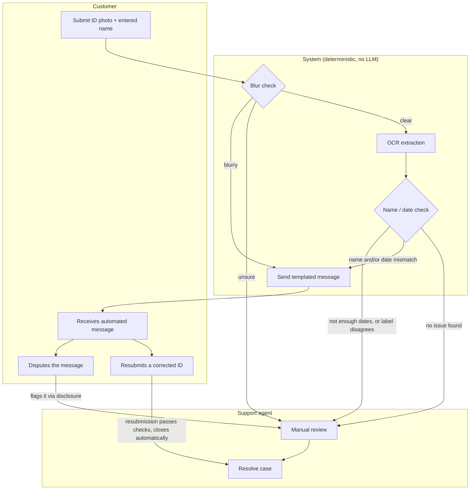

# Voltify: KYC Review Prototype

**Live demo:** https://voltify-kyc.netlify.app/

A lightweight prototype for automating triage of failed KYC (ID verification) checks,
built to prove the approach before asking engineering to build it for real.

---

## Assumptions

- Single static `index.html` file. No build step, no backend, deployed on Netlify.
- No backend to hold a real vision LLM's API key securely, so this prototype uses
  OCR.space instead: a traditional OCR API, not an LLM, whose key can be called directly
  from the browser. That key ends up exposed in client-side JS.
- The only dates assumed present on the card are date of birth, issue date, and
  expiration. Other dates some IDs have are not accounted for.
- No real database. This is a portfolio/interview prototype, not a production system.
- New cases created through the app save to `localStorage` and reload with the page.

---

## Scenarios

Three invented rejection scenarios this prototype handles end to end. Full triage note and
customer message for each: see Example Outputs.

- Scenario 1: Blurry ID
- Scenario 2: Expired ID
- Scenario 3: Name mismatch

---

## Biggest risk

**Risk:** the system is meant to reduce support workload, but a wrong auto-response can
add to it instead. If a customer gets an automated message that's incorrect or doesn't
make sense for their situation, they get frustrated, and support now has to handle both
the original case and an upset customer.

**Mitigation:** never auto-send on low-confidence data, escalate to a human instead. See
the human-in-the-loop mechanism below.

---

<details>
<summary><strong>Deterministic approach</strong> (click to expand: how it works, message templates, live examples, possible cases, the human-in-the-loop mechanism, and known challenges)</summary>

## How it works



Same flow, step by step:

```
INPUT: customer_id_submission (image, entered_name)

STEP 1: Image quality check (deterministic, on-device)
  # Laplacian-variance sharpness score, computed on the uploaded image via canvas
  # pixel data. No API call, no LLM.
  score = compute_sharpness(image)

  IF score < 30:                      # BLUR_THRESHOLD
      classification = "blurry"
  ELIF score > 100:                   # CLEAR_THRESHOLD
      classification = "clear"
  ELSE:
      classification = "unsure"

  IF classification == "blurry":
      SEND message = M1 + M5
      LOG triage_note = "blurry photo auto-detected, message sent"
      STOP

  IF classification == "unsure":
      flag_for_human_review(reason="low_confidence_blur_check")
      STOP

  # classification == "clear", proceed to extraction

STEP 2: OCR extraction (deterministic)
  ocr_text = run_ocr(image)   # one flat text blob, no structured fields or coordinates

STEP 3: Compare fields (deterministic)
  # Name: each word of the entered name is checked independently for presence in the
  # OCR text. Not a single contiguous "First Last" match, which breaks on reversed name
  # order, names split across OCR lines, or a middle name/initial.
  name_issue = ANY token of entered_name NOT found in ocr_text

  # Expiry: every real ID follows DOB < Issue Date < Expiry Date. So the latest
  # plausible date on the card (after dropping obviously implausible matches, more
  # than ~120 years past or ~15 years future) is treated as the expiry. This does not
  # depend on recognizing a label like "Exp" or "Expires". Label vocabulary varies too
  # much across issuers, and OCR reading order does not reliably keep a label next to
  # its value on cards with side-by-side columns.
  plausible_dates = filter_plausible(find_all_dates(ocr_text))
  IF len(plausible_dates) < 2:
      flag_for_human_review(reason="insufficient_dates_found")
      STOP
  extracted_expiry = max(plausible_dates)

  # A recognized label is only a secondary cross-check, never the primary signal.
  label_expiry = find_unambiguous_label_match(ocr_text,
      labels=["EXP","EXPIRES","EXPIRY","DATE OF EXPIRY","VALID THRU","VALID UNTIL","GOOD THRU"])
  IF label_expiry EXISTS AND label_expiry != extracted_expiry:
      flag_for_human_review(reason="date_ordering_and_label_disagree")
      STOP

  date_issue = (extracted_expiry < today)

STEP 4: Build outgoing message
  IF name_issue AND date_issue:
      SEND concatenated(M3, M4) + M5
      LOG triage_note = "name + date mismatch, message sent"
  ELIF name_issue:
      SEND M3 + M5
      LOG triage_note = "name mismatch, message sent"
  ELIF date_issue:
      SEND M4 + M5
      LOG triage_note = "date expired, message sent"
  ELSE:
      flag_for_human_review(reason="unexpected_clear_result")

STEP 5: flag_for_human_review(reason)
  DO NOT auto-send
  LOG triage_note = f"Needs human review: {reason}"
  Notify support queue

STEP 6: Customer responds to the sent message
  IF customer disputes via the disclosure link (M5):
      flag_for_human_review(reason="customer_disputed")
  ELIF customer resubmits a corrected ID:
      re-run STEPS 1-4 on the new submission
      IF no name_issue AND no date_issue:
          CLOSE case automatically
          LOG triage_note = "resubmission passed, case closed automatically"
      # otherwise the new submission's own STEP 4 outcome applies again
```

### No LLM approach: how each check works

#### Image blur

- Draw the photo onto a canvas, shrunk to 300px on the long side.
- Convert to grayscale.
- Run a Laplacian filter, measure the variance.
- Score under 30: blurry. Over 100: clear. In between: unsure.

#### Name matching

- Split the entered name into words.
- Check each word on its own, anywhere in the OCR text.
- Not case-sensitive. Order doesn't matter.
- Every word has to be found for a match.

#### Expiry date

- Find every `MM/DD/YYYY` date in the OCR text.
- Drop anything outside a plausible range (120 years back, 15 years forward).
- Sort what's left. The latest date is the expiry.
- If a label like "Exp" points at one clear date, use it as a cross-check only.
- Cross-check disagrees with the sorted guess: stop, send to a human.

## Variables

### Message table

| ID | Trigger | Message Text |
|---|---|---|
| M1 | Image blurry | "Your ID photo appears too blurry for us to verify. Please retake it in good lighting and resubmit." |
| M2 | Image quality unsure / low confidence | *(no message sent, routed to human review)* |
| M3 | Name mismatch | "We noticed the name on your ID doesn't quite match what's on file." |
| M4 | Date expired | "The ID you submitted appears to be expired. Please upload a valid, unexpired ID." |
| M5 | Automated-check disclosure (always appended) | "This check was completed automatically. If you think something's wrong, flag it here and we'll open a case for a specialist to review." |
| M6 | Unexpected clear image but KYC still failed | *(no message sent, routed to human review)* |

**Concatenation rule:** If both M3 and M4 apply, send: *"We noticed the name on your ID
doesn't quite match what's on file, and the ID also appears to be expired. Please review
both and resubmit."* Always append M5.

## Example Outputs

Not a static writeup anymore. Every mocked case in the queue is a verified result of
running the actual deterministic logic above against its image, not hand-typed data. See
them live: **https://voltify-kyc.netlify.app/**

- **Blurry ID** — John Smith's row. Image was run through the real
  `computeSharpness`/`classifyBlur` code (score 12, below the blur threshold).
- **Name mismatch** — Peter Parker's row. No date field exists on the card at all, so the
  real pipeline stops at "insufficient dates found" before ever reaching a name decision.
  Needs Review, not an auto-sent message.
- **Name + date mismatch, then resolved** — Jordan Blake's row. The one case with fully
  genuine data end to end: real mismatch, real expired date, real auto-sent message,
  customer dispute, and agent resolution.
- **Insufficient dates** — Barbie's and Devon Blackwood's rows, for two different reasons
  (dash-separated dates the parser doesn't read; only one date printed at all).
- **OCR retry failure** — Riley Morgan's row, illustrating what happens when extraction
  itself fails twice in a row.

## Possible cases

The triage logic can produce these outcomes:

| Status | Meaning | Example scenarios |
|---|---|---|
| **Needs Review** (red) | System couldn't confidently triage, or a customer disputed. | Image quality inconclusive ("unsure"), no message sent · Classification failed validation twice, retry limit hit · Only one date found on the card, not enough to sort chronologically |
| **Resolved by Agent** (indigo) | A human manually closed it, shows agent name. | Name mismatch, automated message sent, customer disputes it, an agent manually closes the case |
| **Pending Customer** (amber) | System sent an automated message, no agent involved, case is not resolved, waiting on the customer to act. | Expired ID, case stays open until resubmission · Both name and expiry wrong at once, one concatenated message sent |
| **Closed** (green) | A resubmission passed every check, no dispute, no agent involved. | Customer resubmits a corrected ID, it passes the automated checks, case closes automatically |

## Deterministic logic and the human-in-the-loop mechanism

**Where the human checkpoint sits:**

- A borderline sharpness score ("unsure") goes to a human. Nothing gets sent
  automatically.
- Extraction refuses to guess: fewer than two plausible dates, or a genuine disagreement
  between the ordering guess and a recognized label, both escalate to a human.
- Every auto-sent message discloses that the check was automated (M5) and invites the
  customer to flag it for human review. Jordan Blake's mocked row shows this end to end:
  customer disputes, a human reviews it, agent resolves the case.
- A dispute is the only path to a human that's actually wired up in this prototype. The
  resubmission-passes-so-close-automatically path (STEP 6) is the intended design, not
  yet implemented: there's no code here that re-checks an existing case against a new
  upload. The mocked "Pending Customer" rows just say the ticket is held pending
  resubmission, without showing what happens next.

**If a real vision LLM were used instead** of the on-device sharpness check: every
response would be checked against a fixed list of 3 allowed answers. A response that
doesn't match one of them gets retried once. If it still fails, don't guess, go straight
to a human. That's the mechanism for catching a wrong or hallucinated model answer.

## Challenges

Grouped by what part of the ID they affect: image, date, or name. Likelihood notes are
reasoned estimates, not measured rates — testing against real data would replace them with
actual numbers.

- **Image**
  - **Sharpness vs. legibility**
    - A blurry photo can still score "clear."
    - A sharp photo can score low if it gets shrunk before checking.
    - Doesn't catch a scratch over a letter, tiny text, or bad cropping either.
    - Still open.
    - Likelihood: low with a normal phone photo in good light. Higher with scans, low light, or heavy compression.
  - **OCR inventing data from noise**
    - A smudge on a bad photo can get read as a real letter or number.
    - That fake text can still look like a real date or name.
    - Just checking "something is there" isn't enough. Needs real validation. Not built yet.
    - Likelihood: rises with blur or glare. A single misread digit is much more likely than OCR inventing a whole fake date or name from nothing.
  - **Reading the whole image instead of set fields**
    - OCR reads the whole photo, then the system sorts out the text after.
    - Fix idea: map out where the name, DOB, ID number, and expiry sit on each ID layout. Only read inside those spots.
    - Likelihood: not a per-case risk. It's true on every case, and it's what makes the two risks above possible.

- **Date**
  - **Only one date format supported**
    - Only reads `MM/DD/YYYY`, with slashes.
    - Misses `DD/MM/YYYY`, dots, dashes, or dates like `15 JAN 2028`.
    - Likelihood: depends entirely on which IDs get submitted. Zero risk for US-format IDs, high risk for anything else.
  - **No check on age or ID validity length**
    - Doesn't check if the birth date makes sense for an ID. A 5-year-old's birth date would still pass.
    - Doesn't check if the issue-to-expiry gap matches a normal length (often around 7 years).
    - Fix idea: add both as extra checks.
    - Likelihood: low on its own, most real IDs won't trip this. But it's an unguarded gap, not a tested-and-rare case.

- **Name**
  - **Name order isn't verified, just ignored**
    - Example: card shows `SAMPLE` / `JANICE` instead of `Janice Sample`.
    - Checking each word independently avoids wrongly flagging this as a mismatch, when it's really the same person's ID.
    - But that's not a real fix. The system never verifies order at all, so it can't tell a legitimate swap from a coincidence or from someone else's card.
    - OCR.space can't help here either. It just reads text. It doesn't know which word is a first name or a last name.
    - Real fix needs geometric slicing: read each field by its position on a template, not by scanning the whole blob.
    - Likelihood: the false-mismatch symptom this masks is common, many ID layouts print last name first. The risk it creates instead (below) isn't measured.
  - **Name matching doesn't know which field it's in**
    - Matches a word anywhere on the card, not just the name field.
    - Example: `"Jordan Blake"` would match `"123 Jordan Street"`.
    - Fix idea: same field-mapping idea as above. Needs more work.
    - Likelihood: low for most names, higher for names that are also common street or place words (Jordan, Madison, Lincoln).
  - **Two people with swapped names could match each other**
    - Example: `"James Robert"` and `"Robert James"` are different people.
    - The system only checks if each word is present, not which field it's in.
    - Entering one name could wrongly match the other person's ID.
    - Fix idea: match by field label (First Name vs. Last Name), not by position. Geometric slicing would fix this without breaking the same-person reversed-order case above.
    - Likelihood: rare. Needs two different real people whose names are exact reverses of each other, both showing up as cases.

Before increasing automation on any of these: test against real data, measure actual error
rates, and keep sending low-confidence cases to a human rather than guessing.

</details>

---

<details>
<summary><strong>LLM solution</strong> (click to expand: readings for all 6 cases, and where human-in-the-loop should sit for this approach)</summary>

## LLM solution

For comparison, all six card images used in the queue were read directly by a
vision-capable LLM, the same way the deterministic pipeline gets demonstrated on all six
mocked rows. Here's what it produced for each.

**Blurry ID (John Smith)**

- Deterministic: refuses to read it. Sharpness score 12 auto-classifies as blurry before
  OCR ever runs.
- LLM: can still make out most of the card despite the blur, "JOHN SMITH," a birth date,
  an expiry, an ID number, using context (expected card layout) to fill in what individual
  pixels don't fully resolve.
- Risk: an LLM reading through blur isn't automatically a good thing. Getting a digit
  wrong while sounding confident is a worse failure than correctly saying "too blurry."

**Name mismatch (Peter Parker)**

- Deterministic: reads "LAST NAME: Man, FIRST NAME: Spider." No slash-formatted date
  anywhere on the card, so it stops at "insufficient dates found" and never even reaches a
  name decision.
- LLM: reads the same fields, easily recognizes this is a joke Spider-Man license, and
  would compare "Spider Man" against "Peter Parker" as a mismatch. `ID: 08 10 19 62` is
  clearly labeled as the ID number, not a date, so a careful read wouldn't try to parse it
  as one. There's no real date anywhere on this card either way.

**A hallucination that happened during this run, and why it matters**

On the first read of this card, the LLM read `ID: 08 10 19 62` as a plausible date instead
of what it actually is: a number clearly labeled `ID:` right on the card. That's the exact
failure mode this whole document warns about, pattern-matching something that looks
numeric into the shape you're expecting to find, instead of reading what's actually
labeled. It got caught and corrected here. In a real pipeline with no one checking, that
reading would have gone straight into a decision. This isn't a hypothetical risk being
described, it's the same mistake happening in the process of writing this comparison.

**Name + date mismatch (Jordan Blake)**

- Deterministic: "J. BLAKE" doesn't contain the token "Jordan," so it's flagged as a hard
  mismatch. Expiry 01/05/2024 is correctly read as expired.
- LLM: also reads the card correctly, but can reasonably judge "J. Blake" as very likely
  an abbreviation of "Jordan Blake," a judgment call the token check has no way to make.
  Same conclusion on the expired date.
- Why that's not necessarily good: KYC name checks are usually assumed to need an exact
  match, not a plausible one. The LLM accepting "J." as "Jordan" is a guess dressed up as
  a read. It might be right most of the time, but "probably the same person" isn't the bar
  identity verification is supposed to clear, and this is exactly the kind of judgment
  call that should go to a human instead of getting auto-approved (see Where
  human-in-the-loop should be, below).

**Insufficient dates, dash format (Barbie)**

- Deterministic: birth date prints as `03-10-1959` (dashes, not slashes) and expiry reads
  `NEVER`. Neither matches the parser's date regex, so it finds 0 dates and stops at
  "insufficient dates found."
- LLM: can parse `03-10-1959` as a date regardless of the dashes, no format rigidity. It
  can also read `EXPIRES: NEVER` as a real (if unusual) value rather than just failing to
  match a pattern.

**Insufficient dates, only one printed (Devon Blackwood)**

- Deterministic: only one date on the card at all (date of birth). Needs two to sort
  chronologically, so it stops at "insufficient dates found," same reason as Barbie's row
  but for a different cause.
- LLM: reads the same single date, but can also read `CLASS: PERMANENT` and reasonably
  infer that's *why* there's no expiry field, some ID types genuinely don't expire, rather
  than assuming data is simply missing. Again, a contextual read the deterministic system
  isn't built to make.

**OCR retry failure (Riley Morgan)**

- Deterministic (as mocked): illustrates the extraction service itself failing twice in a
  row, an infrastructure failure, not a data problem. The card's actual text is clean and
  readable, so a real run against this exact image wouldn't hit this failure at all,
  it would pass name and date checks cleanly and land on "unexpected clear result" instead
  (all checks pass, but the case still needs a human look since it arrived here as an
  already-failed KYC check).
- LLM: reading the image directly, there's no separate extraction service to fail in the
  same way. It reads `RILEY MORGAN`, `04/22/1994`, `11/14/2027` without issue, the same
  clean result the deterministic pipeline would reach if it ran past the illustrative retry
  failure. Where an LLM pipeline actually can fail differently: the API call itself timing
  out or erroring, a different failure mode than a text-extraction service returning bad
  data.

### Challenges

The same challenges documented for the deterministic approach above, checked one by one
against an LLM approach: still a problem, solved, or a new shape of the same problem.

- **Image**
  - **Sharpness vs. legibility**
    - Still a problem, different shape. No numeric score to set a threshold on, so "how
      blurry is too blurry" becomes a judgment call instead of a number.
    - Actually improved in one way: an LLM can likely tell a scratch over a letter apart
      from ordinary blur. A sharpness score treats both the same.
  - **OCR inventing data from noise**
    - Still a real risk, maybe a bigger one. An LLM fills gaps with what "looks right" for
      a normal card, which can be more convincing than a simple misread character.
  - **Reading the whole image instead of set fields**
    - Mostly solved. An LLM naturally reads label-value pairs ("FULL NAME: ...") using the
      card's layout. It doesn't need a separate zone map the way flat OCR text does.

- **Date**
  - **Only one date format supported**
    - Solved. An LLM reads dates in any format or layout without a new regex for each one.
  - **No check on age or ID validity length**
    - Not automatic. An LLM won't spontaneously flag an implausible age or validity gap
      unless it's explicitly asked to. Same gap, just moved from "missing code" to
      "missing prompt instruction."

- **Name**
  - **Name order isn't verified, just ignored**
    - Mostly solved. An LLM can read which field is actually labeled "First Name" vs "Last
      Name," so it isn't just checking presence anywhere, it can check the right field.
  - **Name matching doesn't know which field it's in**
    - Same fix as above, solved when the card has clear field labels.
  - **Two people with swapped names could match each other**
    - Reduced, not gone. Field-aware reading catches most of this. But it still can't tell
      two different people apart if they genuinely share the exact same full name. No
      reading approach, deterministic or LLM, can solve that on its own.

### Where human-in-the-loop should be

The deterministic pipeline sends a case to a human when:

- The blur score is borderline ("unsure").
- Fewer than two dates are found, or a label disagrees with the date order.
- The customer disputes the auto-sent message.

An LLM approach needs the same kind of checkpoints, plus a few new ones, since it can be
wrong in new ways:

- **Low-confidence or malformed reads.** If the LLM isn't sure, or its answer doesn't fit
  the expected format, don't guess. Send to a human. Same idea as the deterministic
  "unsure" bucket above.
- **Any judgment call.** Every time the LLM interprets something instead of reading it
  directly ("J." probably means "Jordan," "PERMANENT" probably means no expiry), that's a
  guess, not a fact. Flag these separately and don't auto-send on them alone.
- **No second check.** The deterministic pipeline cross-checks its date guess against a
  label. The LLM has no equivalent self-check. Without one, a wrong read goes straight to
  an auto-sent message with nothing to catch it.

**Where hallucinations are most likely:**

- Reading a blurry or damaged photo and confidently filling in a name or date that "looks
  right" for a normal ID layout, instead of admitting it can't tell.
- Guessing what an abbreviation or unusual value means, and being wrong about it (a
  different person's initial, a real expiry mistaken for "never expires").
- Producing free-text output instead of a fixed set of fields, which makes it harder to
  even notice when something's missing or made up.

**Recommendation:**

- Force the LLM to answer in a strict, fixed format (specific fields only). A response
  that doesn't fit that format is treated as a failure, not guessed at.
- Never auto-send a message based only on a judgment call (abbreviation matching, unusual
  value interpretation). Route those to a human every time.
- Run the LLM and the deterministic check together, not the LLM alone. If they disagree,
  that disagreement is the signal to escalate, the same way the pipeline already escalates
  when the date order and a label disagree.

</details>

---

## Compare results

| | Deterministic (this prototype) | LLM |
|---|---|---|
| Model | None. Laplacian-variance math + regex + string matching. | Claude (vision-capable multimodal model) |
| Blurry image | Refuses to read it. Consistent, but rejects some photos a human could still read. | Can often read through mild blur. Higher success rate, but higher wrong-and-confident risk too. |
| Date format | Only `MM/DD/YYYY`. Anything else is invisible to it. | Reads dates in any format or layout. |
| Abbreviated names | Hard fail. `"J."` != `"Jordan."` | Can judge abbreviations contextually, closer to a human reviewer. |
| Unusual values (`EXPIRES: NEVER`, `CLASS: PERMANENT`) | Not a recognized date, just fails to parse. No idea what it means. | Can reason about what it probably means (a non-expiring ID type) instead of just failing. |
| Why it decided something | Fully traceable. Every decision maps to one line of pseudocode. | Not traceable. No way to know why it accepted an abbreviation without asking it, and it could be wrong. |
| Hallucination risk | None in the message text (static templates). Risk sits entirely in OCR quality. | Real risk: it can state a wrong reading with full confidence, and nothing catches that automatically. |
| Cost per case | Free-tier OCR call, near-zero. | A paid API call per image, real ongoing cost at volume. |
| Speed | Fast, single OCR round trip. | Slower, and depends on the provider's response time. |
| Consistency | Same image always produces the same result. | Can vary between runs on the same image. |

**Which one to trust more:** neither one blindly. The deterministic approach is safer to
automate today because every decision is traceable and repeatable, but it also gives up on
cases a human would clearly solve (blur, odd date formats, abbreviated names). The LLM is
more capable on those edge cases, but every one of those capabilities is also a new way for
it to be plausibly, silently wrong. A real production version would likely use the LLM as
a second opinion when the deterministic path can't decide, not as the primary path.
